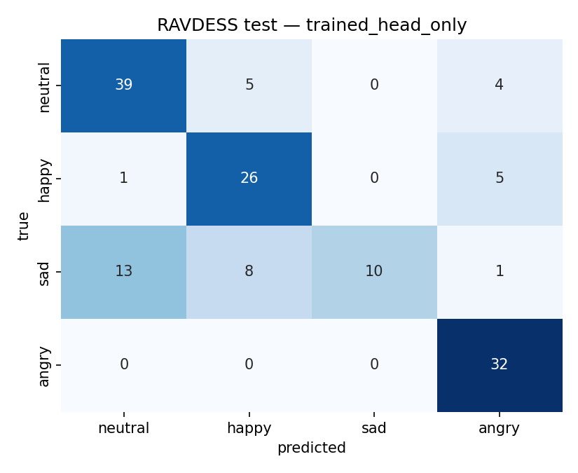
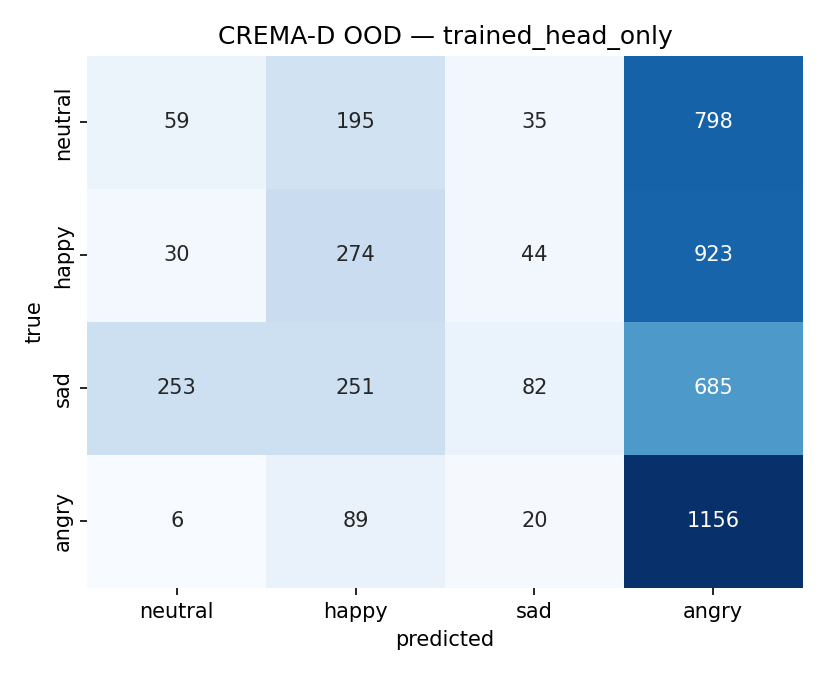

# MoodTune — Speech Emotion Recognition with honest cross-corpus evaluation


## What this project is

MoodTune is a 4-class speech-emotion recognition pipeline (neutral / happy / sad / angry) built on top of a pretrained [Wav2Vec2](https://arxiv.org/abs/2006.11477) encoder. It trains on [RAVDESS](https://zenodo.org/record/1188976) and evaluates **both** in-corpus (RAVDESS held-out speakers) and **out-of-distribution** on [CREMA-D](https://github.com/CheyneyComputerScience/CREMA-D) — a different set of actors, sentences, and recording conditions.

Most public RAVDESS tutorials report accuracy on a random 80/20 split and stop there. That's a weak benchmark: the same 24 actors appear in train and test, so models memorize voices more than they learn emotion. MoodTune is about taking the harder evaluation seriously.

## Key design decisions

### Why speaker-stratified splits
Random splits on RAVDESS leak speaker identity between train and test. The model learns which voice maps to which label rather than what emotion sounds like. MoodTune splits by actor ID — 24 total → **18 train / 2 val / 4 test** — so every voice at eval time is one the model has never heard. The resulting numbers are lower than the inflated benchmarks you see online, and that's the point.

### Why cross-corpus evaluation
A classifier trained on RAVDESS is almost always deployed on non-RAVDESS audio. Evaluating on CREMA-D — different actors, different sentences, different microphones, more varied intensity — surfaces the domain-shift gap that single-corpus benchmarks hide. This drop is usually the difference between a paper result and a demo that works in the wild.

### Why 4 classes, not 8
RAVDESS ships with 8 emotions. Inter-rater agreement on "fearful" vs. "surprised" and "calm" vs. "neutral" is poor — human listeners themselves disagree. Collapsing to {neutral, happy, sad, angry} merges calm into neutral, drops the three hardest classes, and produces a cleaner evaluation signal. The mapping is in `src/config.py`.

### Why Wav2Vec2
Self-supervised pretraining on LibriSpeech gives a strong audio representation for free. Fine-tuning a small classification head on a frozen encoder is the standard 2024 recipe and needs orders of magnitude less data than training from scratch. MoodTune uses `facebook/wav2vec2-base` with the feature encoder frozen; only the projection + classification layers are trainable.

## Current results

10 epochs, head-only fine-tune (encoder frozen), ~4.5 min on Apple Silicon MPS. Trained weights live at `checkpoints/best.pt`; raw numbers in [`results/metrics.json`](results/metrics.json):

| Split              | Before (random head) | After (10 ep, frozen enc.) | n    |
|--------------------|----------------------|----------------------------|------|
| RAVDESS test       | 29.9% / F1 0.19      | **74.3% / F1 0.71**        |  144 |
| CREMA-D (OOD)      | 26.3% / F1 0.11      | 32.1% / F1 0.23            | 4900 |

The **42-point drop** from RAVDESS to CREMA-D is the whole point of the exercise. A model that looks solid on its training corpus — 74% on held-out RAVDESS actors, which is already harder than the 85%+ numbers most public notebooks report on random splits — falls apart on a different corpus with different actors, sentences, and recording conditions. CREMA-D accuracy is only ~7 points above the 25% chance floor. The trained head found something RAVDESS-specific (mic, sentence structure, intensity distribution) rather than a corpus-invariant representation of emotion.

This is the number recruiters should see on a resume. Not "I got 90% on RAVDESS" — *everyone* got 90% on RAVDESS. The value is reporting the drop honestly and having the pipeline to measure it.




Regenerate anytime with `python -m src.train && python -m src.evaluate`.

## Roadmap

- [x] Fine-tune classifier head on the RAVDESS train split (frozen encoder)
- [x] Report the cross-corpus accuracy drop with a trained model
- [ ] Full fine-tune (unfreeze transformer) — expected to push RAVDESS into the 80s
- [ ] Add SpecAugment and waveform-level augmentation (noise, pitch, time-stretch)
- [ ] Domain-adversarial training to close the RAVDESS → CREMA-D gap
- [ ] Extend to multilingual SER via XLSR-53
- [ ] Add a calibration plot — SER models are usually overconfident OOD

## Architecture

```
            ┌──────────────┐
  raw .wav  │  resample    │  waveform (16kHz, 4s, pad/truncate)
  ────────► │  to 16kHz    │ ───────────────────────────────────┐
            └──────────────┘                                     │
                                                                 ▼
                                       ┌───────────────────────────────┐
                                       │  Wav2Vec2 base (frozen enc.)  │
                                       └──────────────┬────────────────┘
                                                      │ hidden states
                                                      ▼
                                       ┌───────────────────────────────┐
                                       │  mean-pool + linear head      │  → 4 logits
                                       └───────────────────────────────┘
```

Data layer: `data/download.py` pulls RAVDESS (Zenodo zip) and CREMA-D (GitHub raw files). `data/prepare.py` parses filenames, maps to the 4-class label space, applies speaker-stratified splits to RAVDESS, and marks CREMA-D as `split=ood`. Result: a single `data/processed/manifest.csv`.

Model layer: `src/model.py` wraps `Wav2Vec2ForSequenceClassification` with the feature encoder frozen. `src/dataset.py` handles audio loading, resampling, and fixed-length padding. `src/evaluate.py` runs inference and emits metrics + confusion matrices.

## Running it locally

```bash
python -m venv .venv && source .venv/bin/activate
pip install -r requirements.txt

# Pull datasets (RAVDESS ~200MB; CREMA-D is larger — use --sample for a fast demo)
python -m data.download --sample

# Build the manifest (splits, label mapping)
python -m data.prepare

# Fine-tune the head — ~5 min on Apple Silicon MPS, saves checkpoints/best.pt
python -m src.train --epochs 10

# Eval — auto-loads checkpoints/best.pt if present, writes metrics + PNGs
python -m src.evaluate

# Launch the Gradio demo
python -m app.demo
```

Inference and the Gradio demo run on CPU. Training uses MPS on Apple Silicon or CUDA if available; the `--unfreeze-encoder` flag trades ~10x longer training for a few points of accuracy.

## Limitations

- Acted emotional speech. RAVDESS and CREMA-D are recorded by voice actors reading fixed sentences. Real-world emotional speech is messier, shorter, and overlapping. SER models trained on acted corpora routinely degrade on spontaneous speech.
- Small speaker pool. 24 RAVDESS actors × 91 CREMA-D actors is enough for a demo, not for a production model.
- English-only. The encoder is trained on English (LibriSpeech). XLSR is in the roadmap.
- No noise robustness. Clean studio recordings only. No channel, compression, or background-noise augmentation yet.
- Fixed 4-second windows. Long utterances are truncated, short ones padded with silence — which the encoder can over-weight.
- Head-only fine-tune. Only the projector + classifier are trained; the Wav2Vec2 transformer is frozen. Unfreezing it (`--unfreeze-encoder`) should close some of the cross-corpus gap.

## References

- Baevski, A., Zhou, H., Mohamed, A., & Auli, M. (2020). *wav2vec 2.0: A Framework for Self-Supervised Learning of Speech Representations.* NeurIPS.
- Livingstone, S. R., & Russo, F. A. (2018). *The Ryerson Audio-Visual Database of Emotional Speech and Song (RAVDESS).* PLoS ONE 13(5).
- Cao, H., Cooper, D. G., Keutmann, M. K., Gur, R. C., Nenkova, A., & Verma, R. (2014). *CREMA-D: Crowd-sourced Emotional Multimodal Actors Dataset.* IEEE Transactions on Affective Computing.

BibTeX entries are in `CITATIONS.bib`.

## License

Code is MIT (`LICENSE`). The RAVDESS corpus is CC BY-NC-SA 4.0; CREMA-D is released under the Open Database License. Neither is redistributed by this repo — the download scripts pull directly from the original sources.
